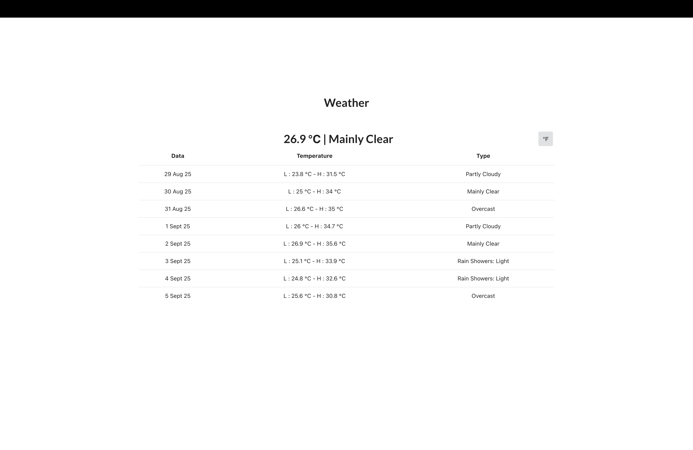
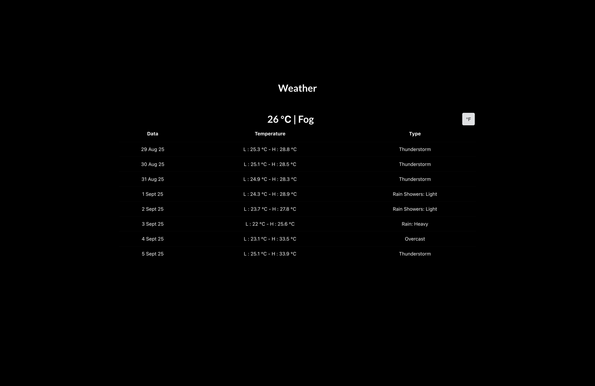

# React Weather App

A simple and responsive weather application built with React that fetches real-time weather data using the [Open-Meteo API](https://api.open-meteo.com/v1/forecast).

## Features
- Displays current weather conditions such as temperature, humidity, and wind speed.
- Fetches real-time data from the Open-Meteo API.
- Fully responsive design for mobile and desktop users.

## Prerequisites

Before you begin, ensure you have the following installed on your system:

- [Node.js](https://nodejs.org/) (v14 or later)
- [npm](https://www.npmjs.com/) or [yarn](https://yarnpkg.com/)

## Getting Started

Follow these steps to set up and run the project locally:

### 1. Clone the Repository

```bash
git clone https://github.com/your-username/react-weather-app.git
cd react-weather-app
```

### 2. Install Dependencies

Run the following command to install the necessary packages:

```bash
npm install
# or
yarn install
```

### 3. Obtain an API Key

The Open-Meteo API does not require an API key, but you should familiarize yourself with their usage guidelines to ensure compliance.

### 4. Configure the API

Update the API endpoint in your project code (if needed) to include the required parameters, such as latitude, longitude, and desired weather information.

Example:

```javascript
const apiUrl = `https://api.open-meteo.com/v1/forecast?latitude=35.6895&longitude=139.6917&current_weather=true`;
```

### 5. Start the Development Server

Run the following command to start the development server:

```bash
npm start
# or
yarn start
```

The app will be available at `http://localhost:3000`.

## Deployment

To deploy the app, build the production-ready version using the following command:

```bash
npm run build
# or
yarn build
```

You can then deploy the contents of the `build` folder to any static hosting service, such as:
- [Netlify](https://www.netlify.com/)
- [Vercel](https://vercel.com/)
- [GitHub Pages](https://pages.github.com/)

## Folder Structure

```
react-weather-app/
├── public/
├── src/
│   ├── components/        # Reusable components (e.g., WeatherCard)
│   ├── styles/            # CSS or styled-components
│   ├── App.js             # Main App component
│   ├── index.js           # Entry point of the app
│   └── utils/             # Helper functions or constants (e.g., API calls)
├── .gitignore
├── package.json
├── README.md
└── yarn.lock / package-lock.json
```

## Technologies Used

- **React**: Frontend library
- **Open-Meteo API**: Weather data provider
- **CSS**: For styling (or any CSS framework used)

## UI/Ux 
### Day Time 

### Night Time


## Usage Instructions

1. Open the application in your browser.
2. Enter the desired location (if applicable).
3. View the current weather conditions for the selected location.

## Contributing

Contributions are welcome! If you have any suggestions or improvements, feel free to open an issue or submit a pull request.

## License

This project is licensed under the [MIT License](LICENSE).

## Acknowledgements

- [Open-Meteo API](https://api.open-meteo.com/) for providing free weather data.
- React community for resources and support.

---

# Getting Started with Create React App

This project was bootstrapped with [Create React App](https://github.com/facebook/create-react-app).

## Available Scripts

In the project directory, you can run:

### `npm start`

Runs the app in the development mode.\
Open [http://localhost:3000](http://localhost:3000) to view it in your browser.

The page will reload when you make changes.\
You may also see any lint errors in the console.

### `npm test`

Launches the test runner in the interactive watch mode.\
See the section about [running tests](https://facebook.github.io/create-react-app/docs/running-tests) for more information.

### `npm run build`

Builds the app for production to the `build` folder.\
It correctly bundles React in production mode and optimizes the build for the best performance.

The build is minified and the filenames include the hashes.\
Your app is ready to be deployed!

See the section about [deployment](https://facebook.github.io/create-react-app/docs/deployment) for more information.

### `npm run eject`

**Note: this is a one-way operation. Once you `eject`, you can't go back!**

If you aren't satisfied with the build tool and configuration choices, you can `eject` at any time. This command will remove the single build dependency from your project.

Instead, it will copy all the configuration files and the transitive dependencies (webpack, Babel, ESLint, etc) right into your project so you have full control over them. All of the commands except `eject` will still work, but they will point to the copied scripts so you can tweak them. At this point you're on your own.

You don't have to ever use `eject`. The curated feature set is suitable for small and middle deployments, and you shouldn't feel obligated to use this feature. However we understand that this tool wouldn't be useful if you couldn't customize it when you are ready for it.


Enjoy using the React Weather App! 😊
